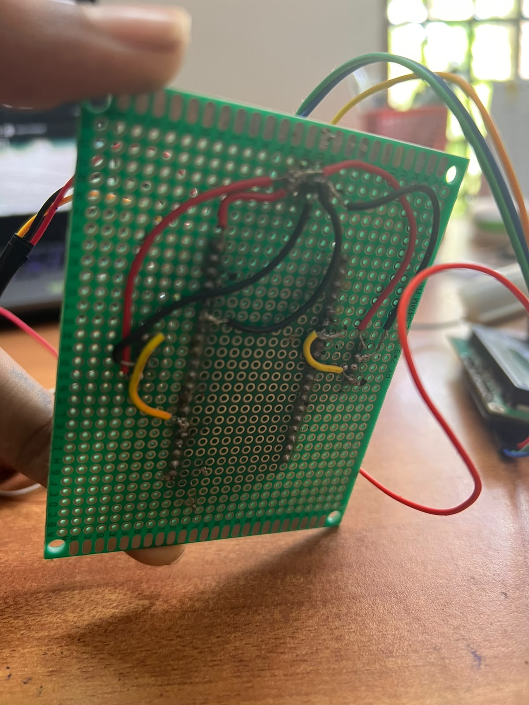
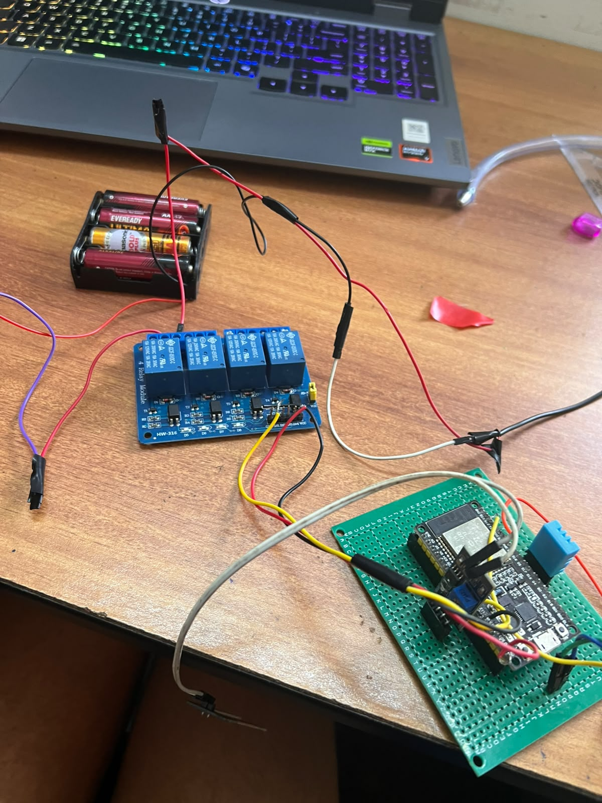
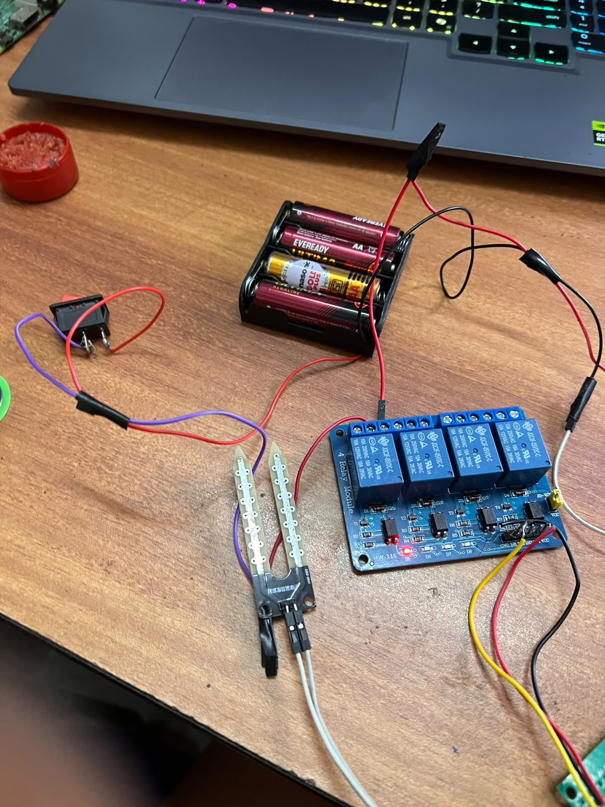
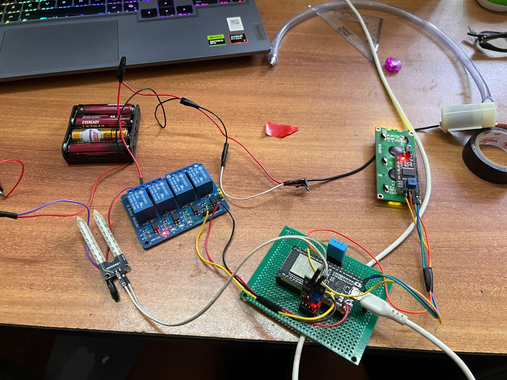

# September 12: Completed the Connections and Insulation

The hardware wiring and insulation work for the prototype has been successfully completed. All major components have been connected, secured, and insulated, preparing the system for the next stage of testing and integration.

**Total time spent: 2:30 hours**

# September 12 3:00pm: Worked on Raspberypi
