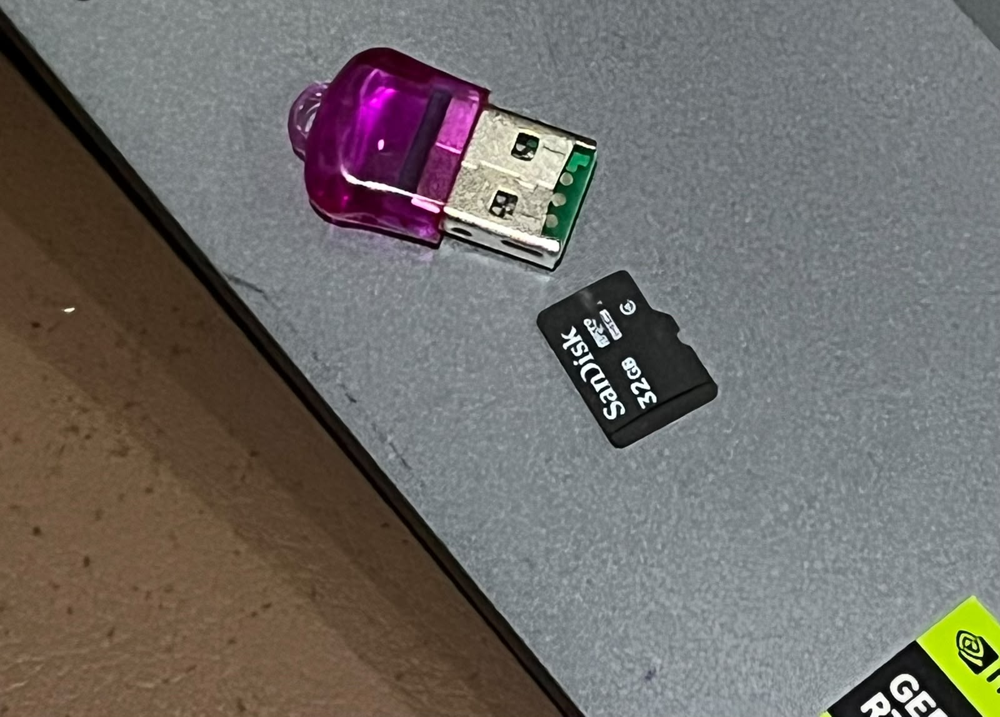
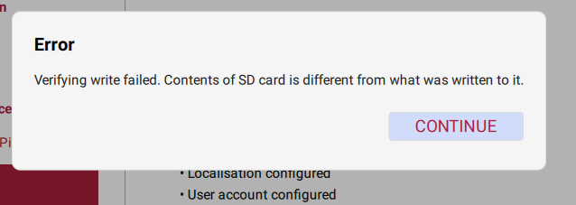
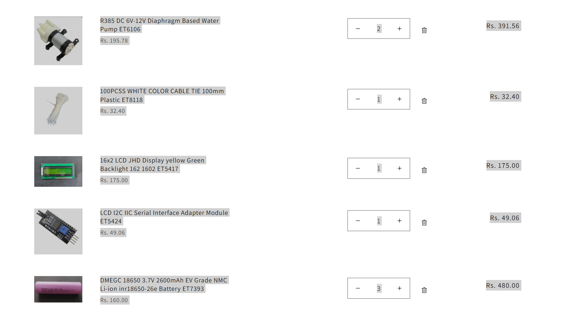

# September 12: Completed the Connections and Insulation

The hardware wiring and insulation work for the prototype has been successfully completed. All major components have been connected, secured, and insulated, preparing the system for the next stage of testing and integration.

**Total time spent:** 2 hours 30 minutes

---

# September 12, 3:00 PM: Worked on Raspberry Pi

Continued development and testing of the Raspberry Pi-based animal intrusion alert system as part of the FloraSync project. The Raspberry Pi 3 Model B was prepared for a headless setup so that it could be accessed from a laptop over Wi-Fi without requiring a dedicated monitor.

The Raspberry Pi OS was written to the microSD card, and the Raspberry Pi was powered on for testing. The power and activity LEDs indicated that the Raspberry Pi was receiving power and accessing the SD card.

During the setup, however, the SD card encountered several issues. Raspberry Pi Imager reported that verification of the written data failed because the contents of the SD card differed from what was written. Attempts to format the card through Windows also failed. DiskPart detected the SD card as a 31 GB removable disk, but attempting to clean the disk resulted in a **"The device is not ready"** error.

As a result, the Raspberry Pi could not yet be successfully configured for the planned Wi-Fi-based headless connection. Further testing of the SD card and card reader is required before continuing with the Raspberry Pi setup.

**Total time spent:** 2 hours

**Progress:**  In Progress — Learned the purpose of using an SD card as the Raspberry Pi's main storage for the operating system and configuration. 
Also learned how to use Raspberry Pi Imager, configure Wi-Fi and SSH, identify SD-card issues, and troubleshoot write and verification failures.

**Issue:** SD card write and verification failure

**Next step:** Already tested the SD card for many times so i am going to buy new SD card.

---

## September 12, 11:00 PM: Purchased Components for FloraSync

Purchased several electronic and mechanical components required for the continued development of the **FloraSync smart agriculture system**. These components will be used across different subsystems, particularly the **AgriBot fertilizer spraying system**, power supply setup, and LCD-based monitoring systems.

The components purchased were:

- **R385 DC 6V–12V Diaphragm Based Water Pump ET6106** — 2 units
- **100mm White Plastic Cable Ties ET8118** — 1 pack of 100
- **16×2 LCD JHD Display with Yellow-Green Backlight ET5417** — 1 unit
- **LCD I2C/IIC Serial Interface Adapter Module ET5424** — 1 unit
- **DMEGC 18650 3.7V 2600mAh EV Grade NMC Li-ion Battery ET7393** — 3 units
- **3-Cell 18650 Battery Holder in Series ET8037** — 1 unit

The two diaphragm-based water pumps will be used for the **AgriBot fertilizer spraying system**. The cable ties will help with wire management and securing components during the construction of the project.

The **16×2 LCD** and **I2C adapter module** will be used for displaying system information, sensor readings, and system status while reducing the number of microcontroller GPIO pins required for the LCD connection.

The three **18650 Li-ion batteries** and the **3-cell series battery holder** will be used to develop a portable power supply for suitable FloraSync hardware components.

These components will help continue the hardware development and integration of the different subsystems of the FloraSync project.

**Total time spent:** 30 minutes

**Progress:** Purchased important hardware components required for the continued development of FloraSync.

**Components purchased:** 2 diaphragm water pumps, 100 cable ties, 1 16×2 LCD, 1 LCD I2C adapter, 3× 18650 Li-ion batteries, and 1 three-cell series battery holder.

**Next step:** Test the newly purchased components and begin integrating them into their respective FloraSync subsystems.
