# September 12: Completed the Connections and Insulation

The hardware wiring and insulation work for the prototype has been successfully completed. All major components have been connected, secured, and insulated, preparing the system for the next stage of testing and integration.

**Total time spent:** 3 hours

---

# September 12, 3:00 PM: Worked on Raspberry Pi

Continued development and testing of the Raspberry Pi-based animal intrusion alert system as part of the FloraSync project. The Raspberry Pi 3 Model B was prepared for a headless setup so that it could be accessed from a laptop over Wi-Fi without requiring a dedicated monitor.

The Raspberry Pi OS was written to the microSD card, and the Raspberry Pi was powered on for testing. The power and activity LEDs indicated that the Raspberry Pi was receiving power and accessing the SD card.

During the setup, however, the SD card encountered several issues. Raspberry Pi Imager reported that verification of the written data failed because the contents of the SD card differed from what was written. Attempts to format the card through Windows also failed. DiskPart detected the SD card as a 31 GB removable disk, but attempting to clean the disk resulted in a **"The device is not ready"** error.

As a result, the Raspberry Pi could not yet be successfully configured for the planned Wi-Fi-based headless connection. Further testing of the SD card and card reader is required before continuing with the Raspberry Pi setup.

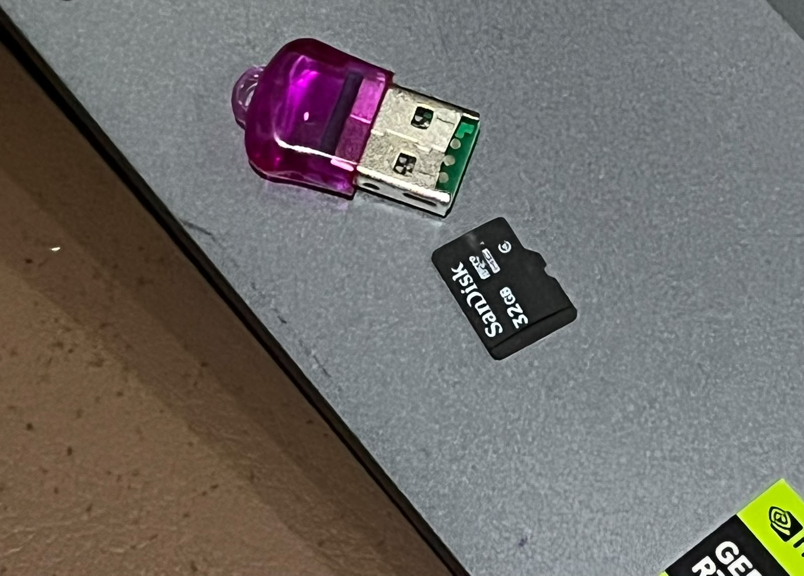
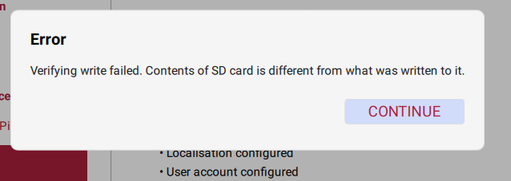

**Total time spent:** 4 hours

**Progress:**  In Progress — Learned the purpose of using an SD card as the Raspberry Pi's main storage for the operating system and configuration. 
Also learned how to use Raspberry Pi Imager, configure Wi-Fi and SSH, identify SD-card issues, and troubleshoot write and verification failures.

**Issue:** SD card write and verification failure

**Next step:** Already tested the SD card for many times so i am going to buy new SD card.

---

## September 12, 11:00 PM: Purchased Components for FloraSync

Purchased several electronic and mechanical components required for the continued development of the **FloraSync smart agriculture system**. These components will be used across different subsystems, particularly the **AgriBot fertilizer spraying system**, power supply setup, and LCD-based monitoring systems.

The components purchased were:

- **R385 DC 6V–12V Diaphragm Based Water Pump ET6106** — 2 units
- **100mm White Plastic Cable Ties ET8118** — 1 pack of 100
- **16×2 LCD JHD Display with Yellow-Green Backlight ET5417** — 1 unit
- **LCD I2C/IIC Serial Interface Adapter Module ET5424** — 1 unit
- **DMEGC 18650 3.7V 2600mAh EV Grade NMC Li-ion Battery ET7393** — 3 units
- **3-Cell 18650 Battery Holder in Series ET8037** — 1 unit

The two diaphragm-based water pumps will be used for the **AgriBot fertilizer spraying system**. The cable ties will help with wire management and securing components during the construction of the project.

The **16×2 LCD** and **I2C adapter module** will be used for displaying system information, sensor readings, and system status while reducing the number of microcontroller GPIO pins required for the LCD connection.

The three **18650 Li-ion batteries** and the **3-cell series battery holder** will be used to develop a portable power supply for suitable FloraSync hardware components.

These components will help continue the hardware development and integration of the different subsystems of the FloraSync project.

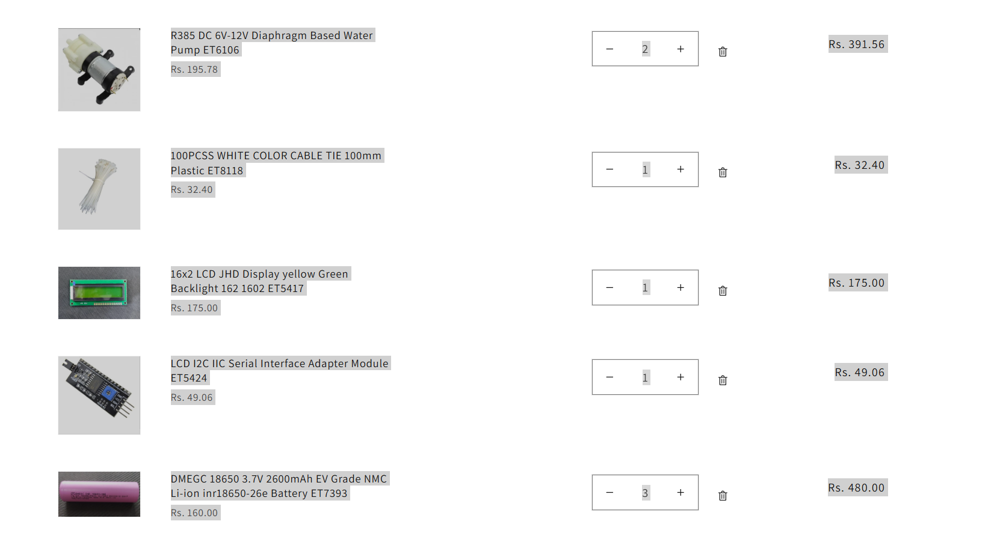

**Total time spent:** 1 hour

**Progress:** Purchased important hardware components required for the continued development of FloraSync.

**Components purchased:** 2 diaphragm water pumps, 100 cable ties, 1 16×2 LCD, 1 LCD I2C adapter, 3× 18650 Li-ion batteries, and 1 three-cell series battery holder.

**Next step:** Test the newly purchased components and begin integrating them into their respective FloraSync subsystems.\

---

## September 13, 1:00 PM: Completed Soldering and Wiring of Desktop Companion

Completed the hardware assembly of the **FloraSync Desktop Companion** by soldering the required components and wires onto a **dotted PCB**. All the planned wire connections were made and securely soldered to create a more permanent and organized circuit.

The components were positioned on the dotted PCB according to the planned arrangement, and the necessary **power, ground, and signal wires** were connected. Care was taken while soldering to ensure that the connections were secure and properly arranged.

With the soldering and wiring completed, the Desktop Companion hardware is now ready for **testing and integration with the FloraSync system**.

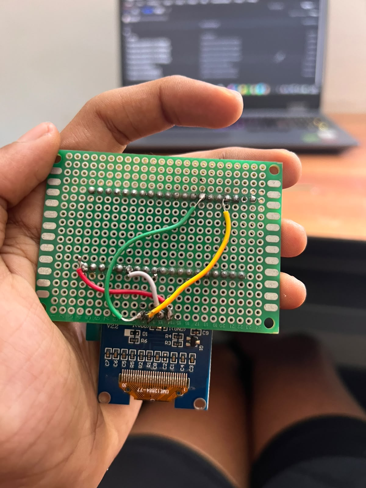
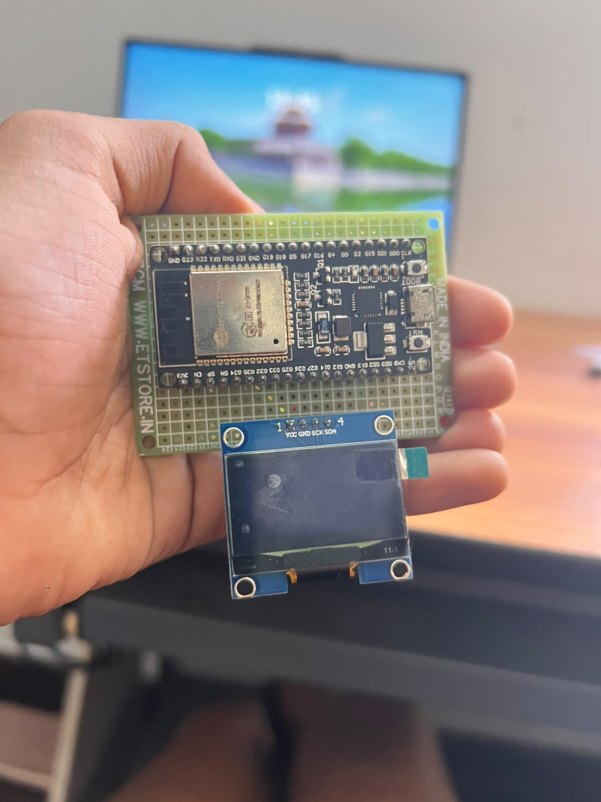

**Total time spent:** 5 hours and 30 minutes

---

# September 27: Completed Turbidity Sensor Connections and Voltage Divider

The turbidity monitoring hardware for the smart pond safety system has been successfully completed. The turbidity sensor was connected to the ESP32 using a dotted PCB, with a two-resistor voltage divider implemented to safely interface the sensor's analog output with the ESP32 ADC.

The voltage divider was constructed using two 10kΩ resistors, reducing the sensor's analog voltage before connecting it to GPIO34. All required connections were soldered securely on the dotted PCB, completing the hardware interface between the turbidity sensor and ESP32.

This completes the turbidity sensing hardware setup and prepares the system for the next stage of testing, calibration, and water-quality monitoring.

Next Step is to complete the whole coding and make it work using mqtt

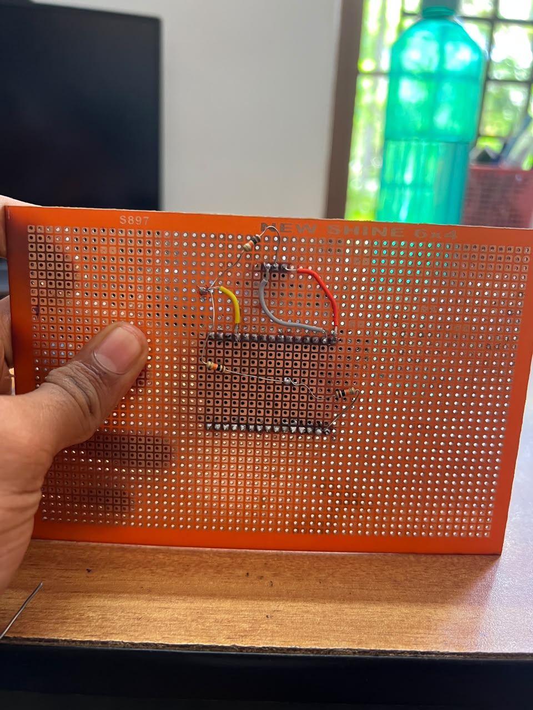

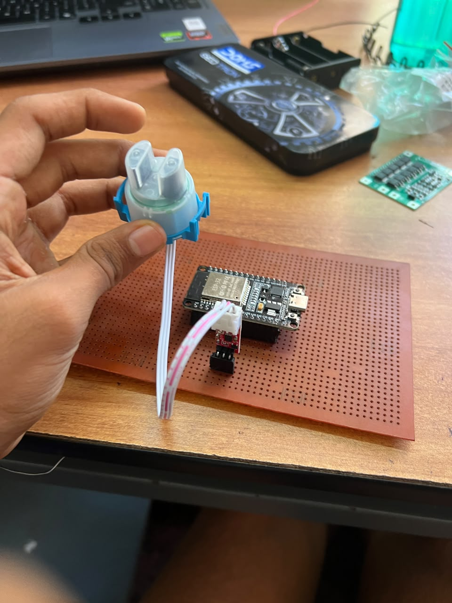

**Components completed:** Turbidity Sensor, ESP32, Dotted PCB, 2 × 10kΩ Resistors

**Total time spent:** 2 hours

**Progress:** Completed the soldering and wiring of the Desktop Companion circuit on the dotted PCB.

**Hardware completed:** Dotted PCB assembly with all required component and wire connections.

---

# September 27 1:30: Connected ESP32-CAM with the Website

Successfully completed the connection between the ESP32-CAM and the FloraSync web dashboard. The ESP32-CAM was configured to connect to the local Wi-Fi network and provide a live video stream from the robot.

The camera stream was integrated into the React-based FloraSync website using the ESP32-CAM stream URL. After troubleshooting the camera IP address and network connection, the live camera feed was successfully displayed directly on the dashboard.

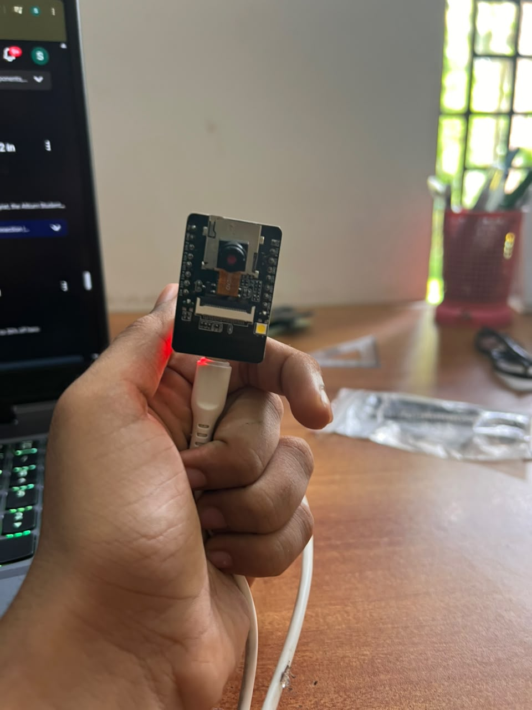

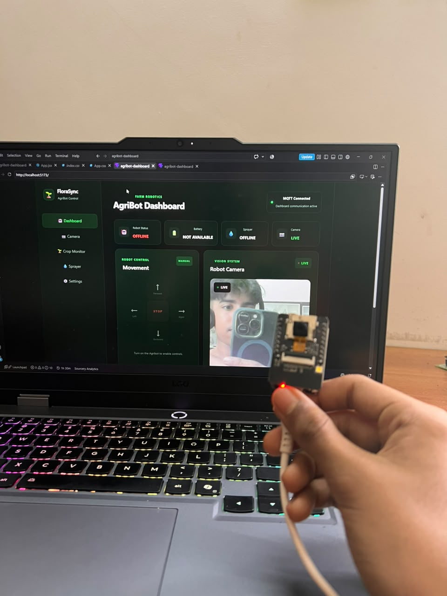

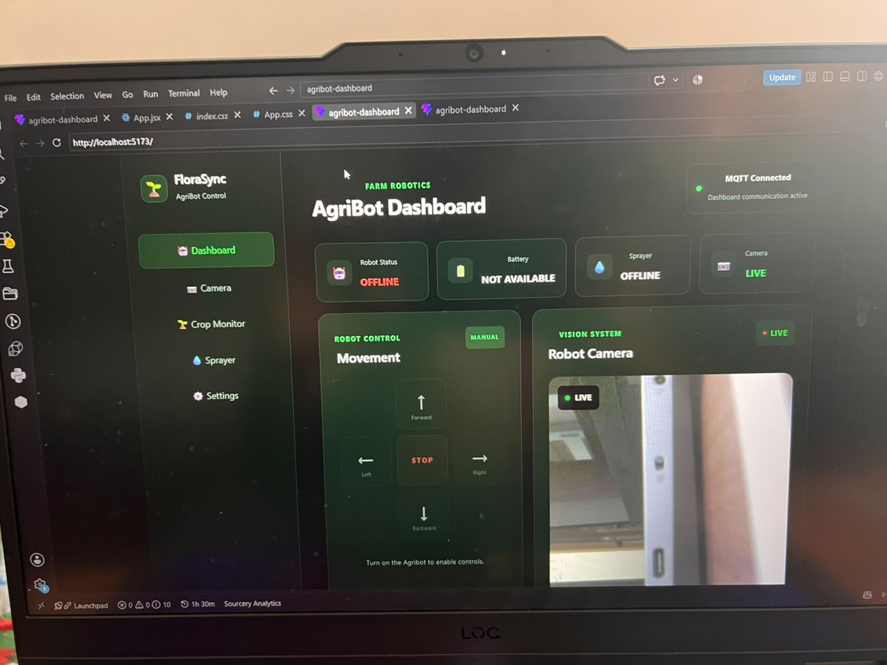

**Total time spent:** 5 hours and 30 minutes

---

# September 28: Completed the BMS and Motor System For Agribot

The battery management and motor system for the agribot pesticide spraying Unit has been successfully completed. A 3-cell (3S) lithium-ion battery pack was integrated with a 3S BMS for battery protection and power management. The motor/pump system was connected through the relay module and tested successfully. The motors operated properly during testing, confirming that the power distribution and switching system are functioning as expected.

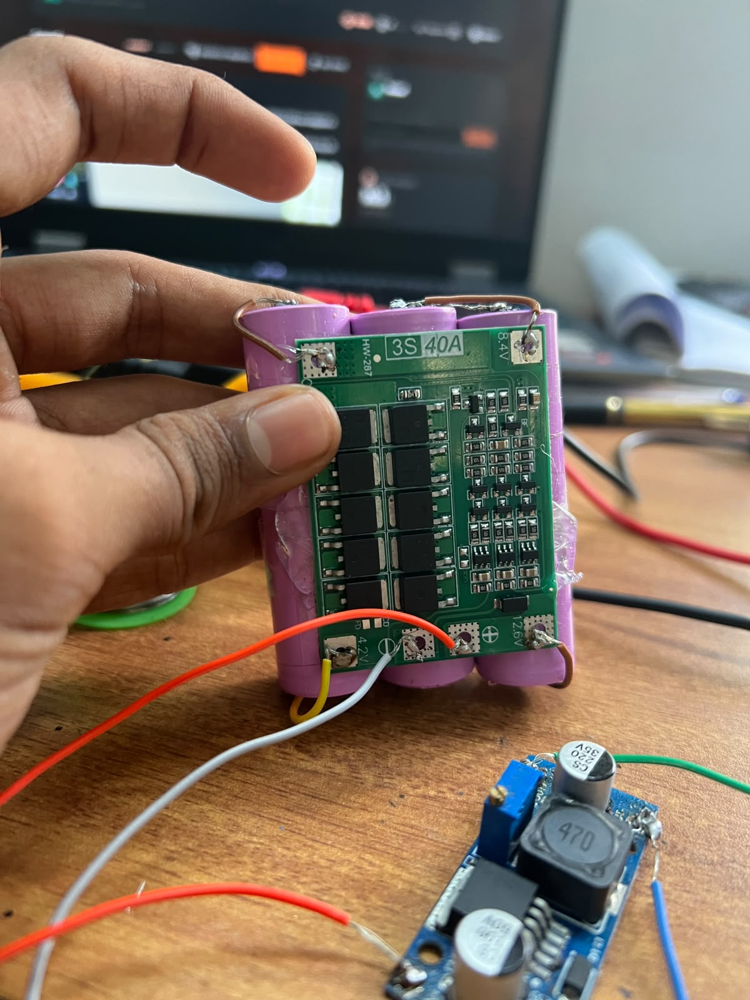

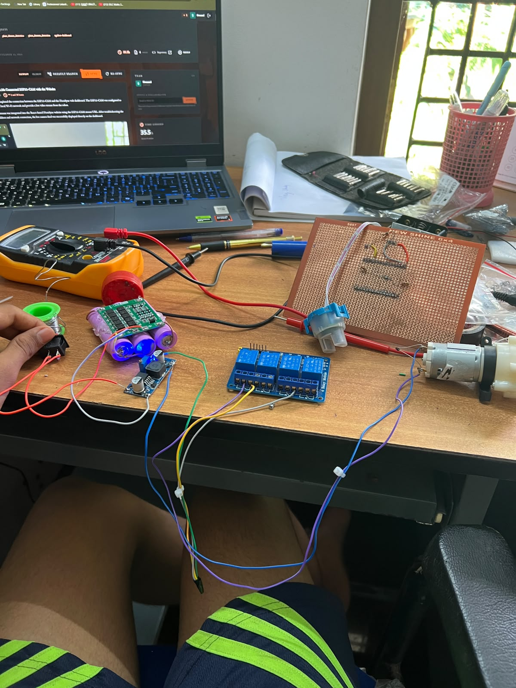

**Total time spent:** 5 hours and 30 minutes

---

# October 6: Completed the AgriBot Mechanical Assembly

The mechanical development of the AgriBot has been successfully completed. The robot chassis was assembled with four wheels, DC motors, and the required hardware components mounted securely on the wooden base.

A T-shaped PVC pipe structure was also fabricated and attached to the AgriBot using M-Seal to create a strong and stable connection. This structure will serve as the main support for the fertilizer spraying mechanism.

The pumps, motor driver, relay module, battery pack, and other components were positioned on the chassis. With the mechanical structure completed, the AgriBot is now ready for further wiring, programming, and integration of the fertilizer spraying system.

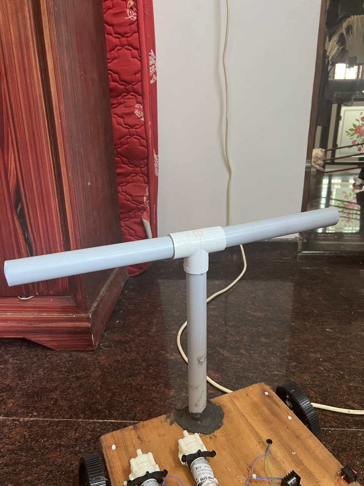

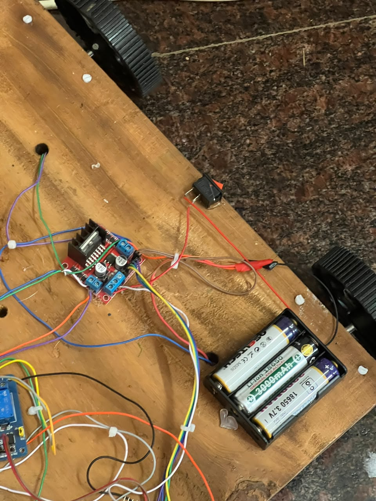

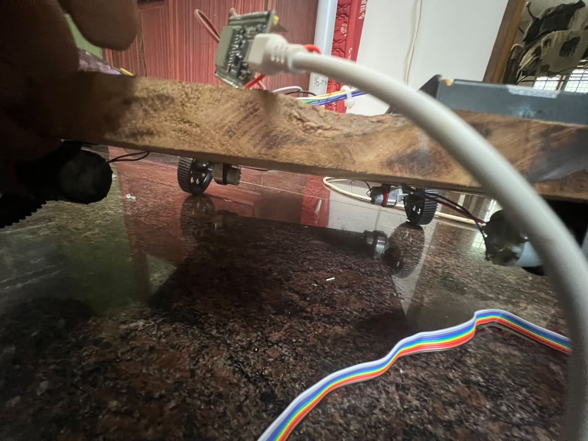

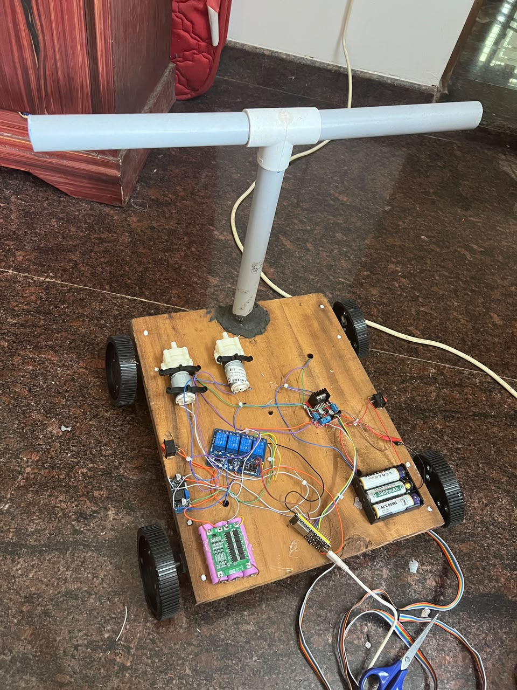

**Total time spent:** 10 hours

---

## October 10: Tested and Replaced the GSM Power Adapter

The power supply for the SIM800A GSM module was tested as part of the FloraSync animal intrusion alert system. During testing, the 9V 2A adapter failed to provide a measurable voltage output, indicating a possible fault with the adapter or its cable.

To resolve this issue, a replacement **ERD 9V 2A Adapter ET5616** was selected for purchase. The replacement adapter is intended to power the SIM800A GSM module through its DC input jack, which is specified for a 9–12V supply.

The GSM module's power supply will be tested again after obtaining the replacement adapter. Once stable power is confirmed, the next step is to verify GSM network registration and test SMS alerts before integrating the module with the Arduino UNO and the laptop-based YOLO animal detection model.

**Total time spent:** 30 minutes

**Progress:** Identified a possible fault with the original power adapter and selected a replacement.

**Issue:** No measurable voltage output from the original adapter during testing.

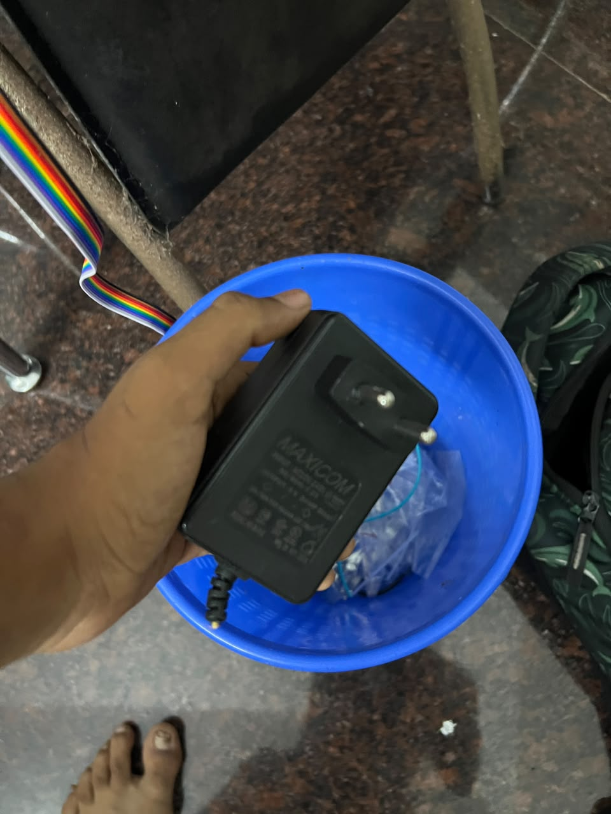

**Next step:** Test the replacement adapter's output and polarity, power the SIM800A safely, and verify GSM communication and SMS delivery.

---

